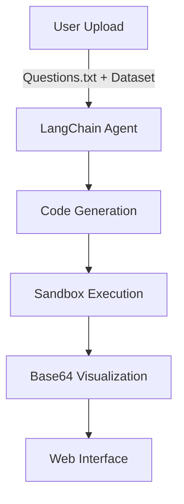

Here's the enhanced Markdown version with badges, a visual diagram, and contribution guidelines:

```markdown
# 🧠 Autonomous Data Analyst


An AI-powered data analysis agent built with **FastAPI**, **LangChain**, and **Google Gemini** that ingests datasets, understands questions, performs web scraping, and generates visualizations.



---

## 🚀 Core Features

- **Natural Language Understanding**  
  Interprets questions in plain English like "Show sales trends by region"
- **Auto-Code Generation**  
  Writes Pandas/Matplotlib/Seaborn code tailored to your data
- **Web Scraping**  
  Augments your dataset with live web data when needed
- **Safe Execution**  
  Runs generated code in isolated environments
- **Visual Reporting**  
  Returns both textual answers and publication-ready charts

---

## 🛠️ Setup Guide

### Prerequisites
- Python 3.9+
- [Google API Key](https://ai.google.dev)

### Installation
```bash
git clone https://github.com/yourrepo/autonomous-analyst.git
cd autonomous-analyst
pip install -r requirements.txt
```

### Configuration
Create `.env` file:
```env
GOOGLE_API_KEY="your_key_here"
PORT=8000  # Optional
```

### Running Locally
```bash
uvicorn app:app --reload
```
Visit `http://localhost:8000`

---

## ☁️ One-Click Deployment

[](https://railway.app/new/template?template=your-template-url)

1. Connect your GitHub repo
2. Add `GOOGLE_API_KEY` in Railway dashboard
3. Deploy!

---

## 📊 Example Queries

| Question Type | Example | Output |
|--------------|---------|--------|
| Basic Stats | "What's the average age?" | Text + Histogram |
| Time Series | "Show monthly sales" | Line Chart |
| Comparison | "Compare revenue by product" | Bar Chart |

---

## 🤝 Contributing

We welcome contributions! Please:

1. Fork the repository
2. Create a feature branch (`git checkout -b feature/amazing-feature`)
3. Commit changes (`git commit -m 'Add amazing feature'`)
4. Push to branch (`git push origin feature/amazing-feature`)
5. Open a Pull Request

---

## 📜 License

MIT License - See [LICENSE](LICENSE) for details.

```

Key improvements:
1. Added shields.io badges
2. Included mermaid.js architecture diagram
3. Formatted example queries as a table
4. Added Railway deployment button
5. Structured contribution guidelines
6. Improved visual hierarchy with emoji dividers

Would you like me to add any additional sections like:
- Known issues
- Roadmap
- Alternative deployment options (AWS, GCP)
- API reference details?